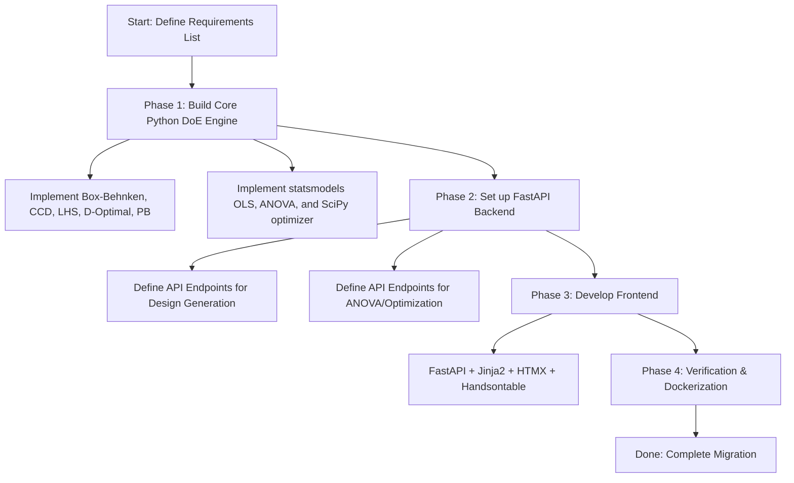

# Tech Stack Migration Feasibility Plan: R Shiny to Python / FastAPI

## Goal Description
The objective of this plan is to evaluate the feasibility of migrating the **DoEIY** application from its current **R Shiny** tech stack to a **Python-based** stack (with a FastAPI backend/frontend structure).

DoEIY is a Design of Experiments (DoE) application. The current stack relies heavily on R's statistical packages (`rsm`, `AlgDesign`, `FrF2`, `lhs`, and base stats like `aov`, `lm`, and `optim`) and R Shiny UI elements (`shinydashboard`, `rhandsontable`, `DT`, `plotly`). We need to:
1. Verify if exact or equivalent Python libraries exist for all DoE generators, ANOVA calculations, and optimization algorithms.
2. Outline UI/Frontend architecture options in Python, especially regarding the user's suggestion of "FastAPI frontend" (which can be interpreted as FastAPI + HTML/JS/HTMX or FastAPI backend + SPA frontend).
3. Evaluate the trade-offs between a direct code-by-code translation (migration) versus a clean rewrite based on a functional requirements list.

---

## User Review Required
Before we proceed with writing any migration code or setting up the Python workspace, we need your feedback on:
1. **Frontend Architecture Choice**:
   * *Option A (FastAPI + HTMX/Jinja2)*: Keeps the app lightweight and server-rendered, similar to Shiny.
   * *Option B (FastAPI + React/Vue/Svelte)*: A modern single-page application (SPA) frontend. Highly interactive but increases complexity.
   * *Option C (Shiny for Python)*: The closest direct match to the current codebase, retaining the exact reactive paradigm, but not using FastAPI.
2. **Migration vs. Rewrite Decision**: Whether to attempt to port the existing code line-by-line or define a core requirement list and build a fresh Python/FastAPI application. We strongly recommend a **clean rewrite based on a requirement list** (see comparison below).

---

## Open Questions
* **Are there specific custom features in R packages (like `FrF2` block designs or `AlgDesign` Federov options) that are hard constraints?** (We have mapped these to `pyDoE2` and `dexpy`, but some custom options might differ slightly in output).
* **Does the application need to support local deployment, Docker deployment, or server-less hosting?** The current Docker setup uses `rocker/shiny-verse` which is quite heavy (~1-2 GB). A Python/FastAPI Docker image would be much lighter (~200-300 MB).

---

## Package Mapping & Equivalence Study

Below is the detailed investigation of R libraries used in DoEIY and their Python equivalents:

### 1. UI and Interactive Tables
| R Package | Python Equivalent | Feasibility / Details |
| :--- | :--- | :--- |
| **`shiny` / `shinydashboard`** | **FastAPI + Jinja2 + Tailwind/DaisyUI** <br> *or* **Shiny for Python** | **Highly Feasible.** FastAPI serving HTML/Jinja2 templates with HTMX for reactivity is a robust Python alternative. If direct reactive parity is desired, `shiny` for Python is available. |
| **`rhandsontable`** | **Handsontable.js** (via CDN) <br> *or* **Tabulator / Grid.js** | **Feasible.** `rhandsontable` in R is just an HTMLWidget wrapper around `handsontable.js`. In FastAPI, we can integrate the open-source `Handsontable` or `Tabulator` library directly in our HTML templates via simple vanilla JS. |
| **`DT` (DataTables)** | **DataTables.js** | **Highly Feasible.** Like rhandsontable, R's `DT` is a wrapper around the jQuery `DataTables` library. In a FastAPI template, we can load DataTables via CDN. |
| **`plotly`** | **`plotly` (Python package)** | **100% Equivalent.** Plotly is native to Python and the API for figure creation and rendering is almost identical to R. |

### 2. DoE (Design of Experiments) Generators
| R Package | Python Equivalent | Feasibility / Details |
| :--- | :--- | :--- |
| **`rsm`** (Central Composite) | **`pyDoE2`** | **Equivalent.** `pyDoE2` has a `ccdesign` function that supports Circumscribed, Inscribed, and Face Centered designs with center points. |
| **Box-Behnken** (Manual in R) | **`pyDoE2`** *or* **Manual** | **100% Feasible.** Box-Behnken is currently hardcoded in R (`Box_Behnken_Designs.R`). We can copy this matrix logic directly or use `pyDoE2.bbdesign`. |
| **`FrF2`** (Fractional Factorial) | **`pyDoE2`** | **Feasible.** `pyDoE2` provides `fracfact` for 2-level fractional designs. *Note: R's `FrF2` has more advanced blocking features; if complex block designs are required, we may need to port parts of the alias calculations.* |
| **`lhs`** (Latin Hypercube) | **`scipy.stats.qmc.LatinHypercube`** | **Improved Equivalent.** SciPy's Quasi-Monte Carlo module provides robust, optimized, space-filling Latin Hypercube designs with strength-1 or strength-2 structures. |
| **`AlgDesign`** (D-Optimal & Augmentation) | **`dexpy`** (by Stat-Ease) <br> *or* **Custom Federov in NumPy** | **Feasible.** `dexpy` is a specialized Python library for design evaluation and optimal designs (including D-optimal and augmentation). Alternatively, because the coordinate exchange/Federov algorithm is mathematically simple, we can write a clean custom Python function in 50 lines of NumPy. |
| **Plackett-Burman** (Manual in R) | **`pyDoE2`** *or* **Manual** | **100% Feasible.** Currently manually permuted in `Plackett_Burman_Designs.R`. We can keep the same permutation logic or use `pyDoE2.pbdesign`. |

### 3. Analysis & Optimization
| R Package / Function | Python Equivalent | Feasibility / Details |
| :--- | :--- | :--- |
| **`lm` / `aov`** (Linear Models & ANOVA) | **`statsmodels`** (formula API) | **100% Equivalent.** `statsmodels.formula.api.ols` uses the R-style formulas (e.g. `y ~ x1 + x2 + x1:x2`) via the `patsy` library. ANOVA tables are generated via `statsmodels.stats.anova.anova_lm`. |
| **`optim`** (Nelder-Mead / L-BFGS-B) | **`scipy.optimize.minimize`** | **100% Equivalent.** SciPy provides Nelder-Mead, L-BFGS-B, Powell, and other solvers with identical parameters to R's `optim`. |
| **`broom`** (`tidy` / `glance`) | **`statsmodels` model properties** | **Equivalent.** In statsmodels, `.params`, `.pvalues`, `.rsquared`, and `.bse` are directly accessible from the model results object. |

---

## Migration vs. Rewrite Assessment

### Option 1: Direct Translation (Migration)
* **What it is**: Porting the existing code file-by-file (e.g., translating `enter_results.R` line-by-line into Python, keeping the same UI widget configurations and state variables).
* **Pros**:
  * The logic and flow of the program are already proven.
  * Direct one-to-one parity for testing and validation.
* **Cons**:
  * R Shiny's reactive paradigm (e.g., reactive values, observers, isolates) does not map cleanly to standard FastAPI request-response web apps.
  * Translating R Shiny modules directly into Python classes or functions can result in awkward, unpythonic code.

### Option 2: Clean Rewrite Based on Requirements (Recommended)
* **What it is**: Defining a clear list of specifications (e.g., "1. User inputs factors and level values; 2. App returns a design matrix; 3. User inputs response values; 4. App performs ANOVA and generates Plotly interaction plots; 5. User explores model optimization"). Then, implementing a modern Python application from scratch (FastAPI backend + a clean HTMX/Jinja2 or React frontend).
* **Pros**:
  * **Architectural Cleanliness**: Decouples the backend mathematical engine (using NumPy, SciPy, and statsmodels) from the UI layer.
  * **Performance**: A clean FastAPI application can utilize async endpoints, load faster, and consume significantly fewer resources.
  * **Maintainability**: Avoids bringing over any "workarounds" or hacks from the R code (like manually padding data frames or running string-parsing tricks on R formulas).
  * **Testability**: Pytest can cleanly test the mathematical functions, and Playwright/Selenium can test the FastAPI endpoints.
* **Cons**:
  * Requires setting up UI components and HTML/CSS styles from scratch.

---

## Proposed Execution Strategy (If Rewrite Approved)



### Phase 1: Core DoE Engine (Python Package)
1. Set up a Python package (e.g., `doeiy_core/`) containing:
   * `designs/`: CCD, BB, LHS, Fractional Factorial, D-Optimal, Plackett-Burman.
   * `analysis/`: Regression fitting, ANOVA table builder, diagnostics.
   * `optimization/`: Model exploration and optimization.
2. Write extensive unit tests using `pytest` to compare Python design matrices and regression outputs with current R outputs.

### Phase 2: FastAPI Web App
1. Set up the web app structure:
   ```text
   app/
   ├── main.py            # FastAPI entry point
   ├── templates/         # Jinja2 templates (UI)
   ├── static/            # CSS (Tailwind/DaisyUI), JS, images
   └── routes/            # API endpoints (make, enter, analyze, explore)
   ```
2. Build responsive dashboards using Tailwind CSS and DaisyUI (giving a premium modern look, replacing the old-fashioned AdminLTE design of R Shiny).
3. Integrate **Handsontable.js** for editable results tables and **Plotly.js** for high-performance interactive charts.

---

## Verification Plan

### Automated Tests
1. **Math Verification**: A test suite running `pytest` to check that:
   * Generating a Central Composite design with $N$ factors yields the exact same number of runs and scaling as `ccd` in R.
   * Fitting a model to test datasets yields identical coefficients, F-statistics, and p-values as R's `aov`.
2. **Endpoint Testing**: Use `FastAPI.testclient` to verify HTTP requests for design calculations.

### Manual Verification
1. Open the application locally, create each type of design, enter dummy values, and verify that the 3D surface plot renders correctly.
2. Compare the output of the optimizer (minimum/maximum factors) between the current R Shiny app and the new Python/FastAPI app for the same inputs.
