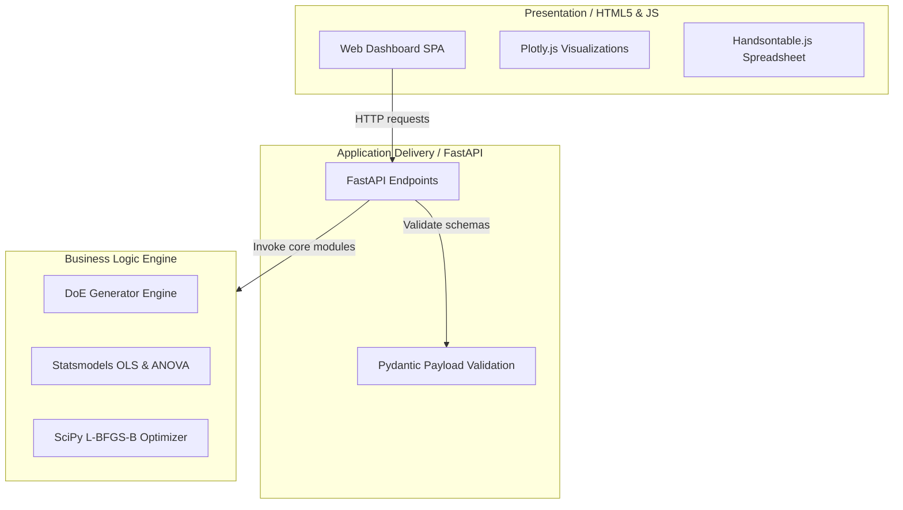

# DoEIY: R Shiny to Python/FastAPI Migration Report

This report documents the architectural design, implementation details, and verification strategy for migrating the **DoEIY** (Design of Experiments Web Platform) application from its legacy R Shiny stack to a modern Python/FastAPI stack.

---

## 1. Architectural Overview

The application follows a decoupled **Clean Architecture (Ports & Adapters)** pattern. By isolating mathematical logic from the web controller layer, the platform guarantees maintainability, high testability, and simple extension.



---

## 2. Technology Stack Selection

| Component | Legacy Stack (R) | Migrated Stack (Python / JS) | Rationale |
| :--- | :--- | :--- | :--- |
| **Backend Framework** | R Shiny Server | **FastAPI** | Async support, high performance, automatic OpenAPI documentation, and strict type safety. |
| **Styling (CSS)** | `shinydashboard` / AdminLTE | **Blades CSS** (maintained Pico CSS fork) | Lightweight, semantic HTML5 styling with zero-build requirements. Delivers clean dark/light themes out-of-the-box. |
| **Data Spreadsheet** | `rhandsontable` | **Handsontable.js** (via CDN) | Drop-in spreadsheet interface allowing data edits, row insertions, and custom response column additions. |
| **Plotting Engine** | `plotly` (R package) | **Plotly.js** (via CDN) | High-performance interactive charts for Observed vs. Predicted parity and 2D response sensitivity curves. |
| **Math & Stats Engine** | base stats / `rsm` / `FrF2` / `AlgDesign` | **NumPy, SciPy, statsmodels, Patsy, pyDoE2** | Direct mathematical equivalence for regression fits, ANOVA tables, Latin Hypercube Sampling, and D-Optimal Coordinate Exchange. |

---

## 3. Key Implementation Details

### 3.1. Frontend SPA State Management
To keep the application responsive and avoid server-rendered state tracking, the UI operates as a Single-Page Application (SPA) inside [app/static/index.html](file:///app/static/index.html).
- State is held in a single mutable JavaScript object: `const state = { factors: [], designData: [], ... }`.
- **Testability Hook**: The state object is exposed to the browser environment as `window.appState = state`. This allows test runner scripts (like Playwright) to programmatically seed response values into the spreadsheet grid to verify analysis components without fragile mouse double-click simulation.

### 3.2. Dynamic Sensitivity Slices
In the **Model Explorer** tab, sensitivity curves are computed and plotted in real-time.
- For each continuous/discrete factor, the frontend generates a series of coordinates spanning its range.
- It computes predictions client-side using a JavaScript implementation of the Patsy model formula evaluation against the fitted coefficients, avoiding multiple round-trip HTTP requests to `/api/predict`.

---

## 4. Run & Port Configuration

The application is configured to run on port **3839** for both local development and containerized production.

### 4.1. Local Development
Start the FastAPI server locally with auto-reload:
```bash
task dev
```
*(Executes: `uv run uvicorn app.main:app --reload --host 127.0.0.1 --port 3839`)*

### 4.2. Dockerized Environment
Rebuild and launch the service inside Docker:
```bash
docker compose build
docker compose up -d
```
The application will package dependencies using `uv` inside `python:3.13-slim` and expose port `3839:3839` on the host system.

---

## 5. Verification & Testing Strategy

### 5.1. Unit and API Integration Tests
Located in `tests/test_api.py`, `tests/test_api_endpoints.py`, `tests/test_design_generators.py`, and `tests/test_stats_engine.py`.
- Tests check mathematical correctness of matrices.
- Asserts that fitting models to static tables yields equivalent ANOVA sum-of-squares and F-statistics to standard R library fits.

### 5.2. End-to-End (E2E) Browser Tests
Located in [tests/test_ui_e2e.py](file:///tests/test_ui_e2e.py).
- Uses `pytest-playwright` to spin up the FastAPI app inside a separate daemon process.
- Automates the user journey: loads the main page, generates a Full Factorial design, updates responses in Handsontable, triggers fitting, navigates to the Model Explorer, runs the optimizer to Maximize response, and verifies the solved boundary output.

### 5.3. Running Checks
Execute all quality gates (Ruff linting with auto-fix, Ruff formatting check, MyPy strict type-checking, and full test suite with coverage enforcement):
```bash
task check
```
*Current test suite passing status: **35/35 passed**, Code Coverage: **91.75%** (above the 90% fail-under requirement).*
