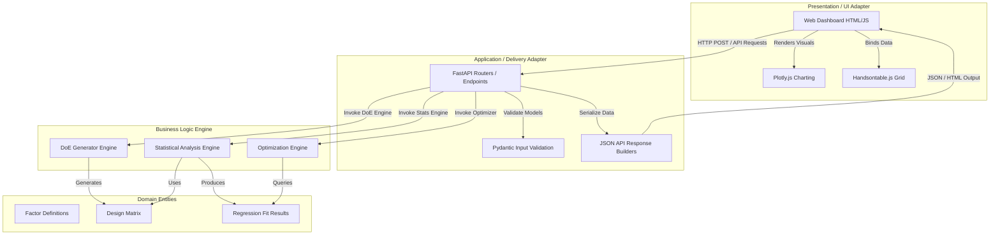
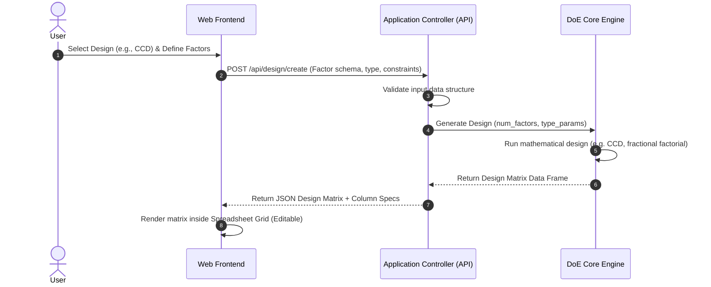

# DoEIY: Rewrite System Design, Requirements & Implementation Guide

This document presents a comprehensive, language-independent **System Design Map**, a detailed **Requirements Sheet** for the application rewrite, and a **Step-by-Step Guide** to building the equivalent application in **Python / FastAPI**.

---

## 1. System Design Map (Language-Independent)

The system is designed using a **Clean Architecture (Ports and Adapters)** pattern. This ensures that the core mathematical and statistical logic is completely isolated from the web presentation framework (whether it is R Shiny, FastAPI, or a SPA).

### Architecture Structure



### Data Flow Maps

#### Flow A: Design Generation Phase


#### Flow B: Model Analysis & Exploration Phase
```mermaid
sequenceDiagram
    autonumber
    actor User
    participant UI as Web Frontend
    participant Controller as Application Controller (API)
    participant Stats as Statistical Engine
    participant Opt as Optimizer Engine

    User->>UI: Enter response values into Grid & Click "Analyze"
    UI->>Controller: POST /api/analysis/fit (Design matrix + response column)
    Controller->>Stats: Fit Regression Model (formula, data)
    Stats->>Stats: Compute coefficients, ANOVA table, F-stats, residuals
    Stats-->>Controller: Return Model fit metrics & predictions
    Controller-->>UI: Return ANOVA table & Plot data (JSON)
    UI->>UI: Render ANOVA table & Plotly Residual charts

    User->>UI: Adjust Factor Sliders to explore model predictions
    UI->>Controller: POST /api/analysis/predict (Model coefficients, factor values)
    Controller-->>UI: Return Predicted response value (Real-time update)

    User->>UI: Choose target (e.g. Maximize) & click "Optimize"
    UI->>Controller: POST /api/analysis/optimize (Model, bounds, objective)
    Controller->>Opt: Solve objective (bounds, initial_values)
    Opt->>Opt: Run solver (e.g., Nelder-Mead / L-BFGS-B)
    Opt-->>Controller: Return optimal factor values & response
    Controller-->>UI: Update UI sliders & predictions with optimal values
```

---

## 2. Requirements Sheet for Rewrite

### 1. Functional Requirements

#### 1.1 Design of Experiments (DoE) Module
* **R1.1.1**: Support generation of the following design types:
  * **Screening**: Plackett-Burman (4-23 factors, 2-level, cyclic permutation logic).
  * **Factorial**: Full Factorial (custom levels per factor) and Fractional Factorial (2-level designs with alias/resolution calculation).
  * **Response Surface**: Box-Behnken (3-12 factors, 3-level) and Central Composite (Circumscribed, Inscribed, and Face Centered).
  * **Space Filling**: Latin Hypercube Sampling (LHS) with improved space-filling properties.
  * **Custom/Algorithmic**: D-Optimal designs and D-Optimal Augmentation of existing runs based on user-supplied model formulas.
* **R1.1.2**: Normalise all design factors to standard design spaces (typically continuous variables scaled between $[-1, 1]$) and support restoration to native scales.

#### 1.2 Results Entry / Spreadsheet Interface
* **R1.2.1**: Provide a spreadsheet-like data grid allowing users to add response columns, input experimental outcomes, and edit factor values.
* **R1.2.2**: Support export of the design matrix to CSV and import of existing designs from CSV.

#### 1.3 Statistical Analysis Module
* **R1.3.1**: Compute linear regression model parameters (coefficients, standard errors, t-statistics, p-values).
* **R1.3.2**: Generate a standard Analysis of Variance (ANOVA) table (Degrees of freedom, Sum of Squares, Mean Squares, F-values, and p-values for model terms).
* **R1.3.3**: Compute diagnostic metrics (R-squared, Adjusted R-squared, residuals).

#### 1.4 Model Explorer & Visualisation Module
* **R1.4.1**: Display dynamic 2D sensitivity plots showing the response profile for individual factors while holding other factors constant.
* **R1.4.2**: Generate interactive correlation heatmaps of factors and interactions.
* **R1.4.3**: Offer real-time prediction updates when user interacts with sliders.
* **R1.4.4**: Provide a mathematical optimizer to find factor settings that maximize, minimize, or target a specific response value based on the fitted model.

### 2. Technical & Non-Functional Requirements

* **R2.1 (Decoupling)**: UI code must not contain mathematical calculations; logic must reside inside an independent business engine module.
* **R2.2 (API Design)**: The backend must expose standard JSON-based REST endpoints.
* **R2.3 (Performance)**: The application must load pages in less than 500ms, and API predictions/optimization updates must execute in under 50ms.
* **R2.4 (Validation)**: All data payloads passed between the UI and API must be strictly validated at the controller boundary.
* **R2.5 (Dockerization)**: Provide a multi-stage Docker deployment script. The final image size must be under 350 MB (excluding cache).
* **R2.6 (Testability)**: Aim for $\ge 90\%$ test coverage on the mathematical core, and provide end-to-end integration tests for routing endpoints.

---

## 3. Step-by-Step Implementation Guide (Python / FastAPI)

Here is how to implement the application in Python, utilizing **FastAPI**, **Jinja2 + HTMX** (for reactive page updates without complex SPA setups), **Handsontable.js**, and **Plotly.js**.

### Project File Structure

```text
doeiy-python/
├── Dockerfile
├── requirements.txt
├── Taskfile.yml
├── tests/
│   ├── __init__.py
│   ├── test_doe_engine.py
│   └── test_api.py
└── app/
    ├── __init__.py
    ├── main.py                 # FastAPI application setup
    ├── models/
    │   └── schemas.py          # Pydantic schemas for requests/responses
    ├── engine/                 # Core DoE & Statistics engine (Independent)
    │   ├── __init__.py
    │   ├── design_generators.py# CCD, BB, LHS, PB, Fractional/Full Factorial
    │   ├── stats_engine.py     # Statsmodels regression and ANOVA
    │   └── optimizer.py        # SciPy optimization routines
    ├── static/                 # Static files (CSS, JS, images)
    │   ├── css/
    │   │   └── styles.css      # Custom Tailwind styling
    │   └── js/
    │       └── app.js          # Handsontable and Plotly binders
    └── templates/              # Jinja2 HTML templates (HTMX-augmented)
        ├── base.html
        ├── make_design.html
        ├── enter_results.html
        ├── analyze.html
        └── explore.html
```

---

### Step 1: Install Dependencies
Create a `requirements.txt` containing the necessary mathematical and web libraries:
```text
fastapi>=0.100.0
uvicorn[standard]>=0.22.0
jinja2>=3.1.2
pydantic>=2.0.0
numpy>=1.24.0
pandas>=2.0.0
scipy>=1.10.0
statsmodels>=0.14.0
patsy>=0.5.3
pyDoE2>=1.3.0
pytest>=7.3.0
```

---

### Step 2: Build the Core DoE Engine (`app/engine/design_generators.py`)

Here is how to implement the generators using **SciPy**, **pyDoE2**, and custom numpy arrays.

```python
import numpy as np
import pandas as pd
from scipy.stats import qmc
import pyDoE2

def generate_full_factorial(factor_levels: list[int]) -> pd.DataFrame:
    """
    Creates a full factorial design.
    factor_levels: e.g., [2, 3, 2] means Factor 1 has 2 levels, Factor 2 has 3, etc.
    """
    levels_list = [list(range(1, k + 1)) for k in factor_levels]
    grid = np.meshgrid(*levels_list, indexing='ij')
    flat_grid = np.stack(grid, axis=-1).reshape(-1, len(factor_levels))

    df = pd.DataFrame(flat_grid, columns=[f"Var{i+1}" for i in range(len(factor_levels))])
    return df

def generate_latin_hypercube(num_factors: int, num_runs: int) -> pd.DataFrame:
    """
    Generates an optimized space-filling Latin Hypercube design.
    """
    sampler = qmc.LatinHypercube(d=num_factors, optimization="random-cd")
    sample = sampler.random(n=num_runs)
    # Scale from [0, 1] to [-1, 1] to match the standard design space
    scaled_sample = qmc.scale(sample, -1, 1)

    df = pd.DataFrame(scaled_sample, columns=[f"Var{i+1}" for i in range(num_factors)])
    return df

def generate_central_composite(num_factors: int, ccd_type: str) -> pd.DataFrame:
    """
    Generates a Circumscribed, Inscribed, or Face-Centered CCD.
    """
    # pyDoE2 supports CCD generation
    # ccd_type is one of: "Circumscribed", "Inscribed", "Face Centered"
    face_type = "faced" if ccd_type == "Face Centered" else "cci" if ccd_type == "Inscribed" else "ccc"
    design = pyDoE2.ccdesign(n=num_factors, face=face_type)

    df = pd.DataFrame(design, columns=[f"Var{i+1}" for i in range(num_factors)])
    return df

def generate_plackett_burman(num_factors: int) -> pd.DataFrame:
    """
    Generates a 2-level Plackett-Burman screening design.
    """
    # Standard cyclic generators matched exactly to the R version
    if 4 <= num_factors < 8:
        gen = [1, 1, 1, -1, 1, -1, -1]
    elif 8 <= num_factors < 12:
        gen = [1, 1, -1, 1, 1, 1, -1, -1, -1, 1, -1]
    elif 12 <= num_factors < 16:
        gen = [1, 1, 1, 1, -1, 1, -1, 1, 1, -1, -1, 1, -1, -1, -1]
    elif 16 <= num_factors < 20:
        gen = [1, 1, -1, -1, 1, 1, 1, 1, -1, 1, -1, 1, -1, -1, -1, -1, 1, 1, -1]
    elif 20 <= num_factors <= 23:
        gen = [1, 1, 1, 1, 1, -1, 1, -1, 1, 1, -1, -1, 1, 1, -1, -1, 1, -1, 1, -1, -1, -1, -1]
    else:
        raise ValueError("Plackett-Burman supports 4 to 23 factors in this module.")

    runs = len(gen)
    design_matrix = np.zeros((runs, num_factors))
    design_matrix[:, 0] = gen

    for j in range(1, num_factors):
        design_matrix[:, j] = np.roll(design_matrix[:, 0], j)

    # Append final row of all -1s
    design_matrix = np.vstack([design_matrix, -np.ones(num_factors)])
    df = pd.DataFrame(design_matrix, columns=[f"Var{i+1}" for i in range(num_factors)])
    return df
```

---

### Step 3: Implement Regression & ANOVA Engine (`app/engine/stats_engine.py`)

Using `statsmodels.formula.api.ols` for R-style model formula fitting.

```python
import statsmodels.api as sm
import statsmodels.formula.api as smf
import pandas as pd

def fit_regression_model(data: pd.DataFrame, formula: str) -> dict:
    """
    Fits an OLS model to the design matrix data.
    Formula example: "Response ~ Var1 + Var2 + I(Var1**2) + Var1:Var2"
    """
    model = smf.ols(formula, data=data).fit()
    anova_table = sm.stats.anova_lm(model, typ=1) # Sequential Type I Sum of Squares

    # Structure parameters equivalent to R's summary()
    coefficients = []
    for name in model.params.index:
        coefficients.append({
            "term": name,
            "estimate": model.params[name],
            "std_error": model.bse[name],
            "t_value": model.tvalues[name],
            "p_value": model.pvalues[name]
        })

    anova_rows = []
    for index, row in anova_table.iterrows():
        anova_rows.append({
            "term": index,
            "df": int(row["df"]),
            "sum_sq": row["sum_sq"],
            "mean_sq": row["mean_sq"],
            "f_value": row["F"] if not pd.isna(row["F"]) else None,
            "p_value": row["PR(>F)"] if not pd.isna(row["PR(>F)"]) else None
        })

    return {
        "coefficients": coefficients,
        "anova": anova_rows,
        "r_squared": model.rsquared,
        "adj_r_squared": model.rsquared_adj,
        "fitted_values": model.fittedvalues.tolist(),
        "residuals": model.resid.tolist(),
        "model_object": model # Kept for prediction and optimization phases
    }
```

---

### Step 4: Implement Optimizer Engine (`app/engine/optimizer.py`)

Using `scipy.optimize.minimize` for bounds-constrained optimization.

```python
from scipy.optimize import minimize
import numpy as np

def optimize_response(model, factor_names: list[str], bounds: list[tuple[float, float]], opt_type: str, target_val: float = None) -> dict:
    """
    Finds the optimal settings of factors to maximize, minimize, or target a response value.
    """
    # 1. Define objective function based on model prediction
    def objective(x):
        # Build dictionary matching variable names to values
        pred_dict = {name: [val] for name, val in zip(factor_names, x)}
        pred_df = pd.DataFrame(pred_dict)
        pred = model.predict(pred_df)[0]

        if opt_type == "Maximize":
            return -pred
        elif opt_type == "Minimize":
            return pred
        elif opt_type == "Find Target":
            return (pred - target_val) ** 2
        return pred

    # 2. Set starting point at the center of the bounds
    x0 = [np.mean(b) for b in bounds]

    # 3. Solve optimization problem
    res = minimize(objective, x0, bounds=bounds, method="L-BFGS-B")

    return {
        "success": bool(res.success),
        "optimal_factors": {name: val for name, val in zip(factor_names, res.x)},
        "optimal_response": -res.fun if opt_type == "Maximize" else res.fun if opt_type == "Minimize" else model.predict(pd.DataFrame({n: [v] for n, v in zip(factor_names, res.x)}))[0]
    }
```

---

### Step 5: Define API Controller & Routes (`app/main.py`)

Here we set up **FastAPI** to expose the endpoints and serve standard HTML pages augmented with **HTMX**.

```python
from fastapi import FastAPI, Request, Form
from fastapi.responses import HTMLResponse
from fastapi.staticfiles import StaticFiles
from fastapi.templating import Jinja2Templates
from pydantic import BaseModel
import pandas as pd
from app.engine.design_generators import generate_central_composite, generate_plackett_burman

app = FastAPI(title="DoEIY - Design of Experiments")
app.mount("/static", StaticFiles(directory="app/static"), name="static")
templates = Jinja2Templates(directory="app/templates")

# Data Models
class FactorInput(BaseModel):
    name: str
    type: str
    levels: str # comma separated e.g. "-1, 1"

class DesignRequest(BaseModel):
    design_type: str
    factors: list[FactorInput]

# --- Page Routes ---
@app.get("/", response_class=HTMLResponse)
async def home(request: Request):
    return templates.TemplateResponse("base.html", {"request": request, "active_tab": "make"})

@app.get("/make", response_class=HTMLResponse)
async def make_design_page(request: Request):
    return templates.TemplateResponse("make_design.html", {"request": request})

# --- HTMX / API Endpoints ---
@app.post("/api/design/generate")
async def api_generate_design(design_type: str = Form(...), num_factors: int = Form(...)):
    """
    Invoked via HTMX POST. Generates design and returns the interactive spreadsheet HTML.
    """
    if design_type == "Central Composite":
        df = generate_central_composite(num_factors, "Circumscribed")
    elif design_type == "Plackett-Burman":
        df = generate_plackett_burman(num_factors)
    else:
        df = pd.DataFrame()

    # Convert data frame to JSON records for binding to Handsontable
    records = df.to_dict(orient="records")
    columns = [{"data": col, "title": col} for col in df.columns]

    return {
        "status": "success",
        "data": records,
        "columns": columns
    }
```

---

### Step 6: Create Frontend UI Binders (`app/static/js/app.js`)

Instead of writing a complex frontend framework (React), we instantiate **Handsontable** and **Plotly** inside the HTML template dynamically.

```javascript
// Initialize Handsontable spreadsheet
let hotInstance = null;

function loadSpreadsheet(containerId, rowData, columnDefs) {
    const container = document.getElementById(containerId);

    if (hotInstance) {
        hotInstance.destroy();
    }

    hotInstance = new Handsontable(container, {
        data: rowData,
        columns: columnDefs,
        rowHeaders: true,
        colHeaders: true,
        stretchH: 'all',
        height: 'auto',
        minSpareRows: 0,
        licenseKey: 'non-commercial-and-evaluation' // Open source evaluation key
    });
}

// Generate interactive plotly diagnostics charts
function renderDiagnosticsPlot(containerId, actual, predicted) {
    const trace = {
        x: actual,
        y: predicted,
        mode: 'markers',
        type: 'scatter',
        marker: { color: '#3b82f6', size: 10 }
    };

    const diagonal = {
        x: [Math.min(...actual), Math.max(...actual)],
        y: [Math.min(...actual), Math.max(...actual)],
        mode: 'lines',
        type: 'scatter',
        line: { color: 'gray', dash: 'dash' },
        showlegend: false
    };

    const layout = {
        title: 'Predicted vs. Actual Values',
        xaxis: { title: 'Actual Outcome' },
        yaxis: { title: 'Model Predicted Outcome' },
        plot_bgcolor: '#f8fafc',
        paper_bgcolor: 'transparent'
    };

    Plotly.newPlot(containerId, [trace, diagonal], layout);
}
```

---

### Step 7: Containerize the Application (`Dockerfile`)

A multi-stage build keeping the deployment extremely slim.

```dockerfile
# Stage 1: Build & Dependencies installer
FROM python:3.11-slim as builder

WORKDIR /code
COPY requirements.txt .

RUN apt-get update && apt-get install -y --no-install-recommends gcc build-essential \
    && pip install --user --no-cache-dir -r requirements.txt \
    && apt-get purge -y --auto-remove gcc build-essential \
    && rm -rf /var/lib/apt/lists/*

# Stage 2: Final Light Image
FROM python:3.11-slim

WORKDIR /app
COPY --from=builder /root/.local /root/.local
COPY ./app /app/app

ENV PATH=/root/.local/bin:$PATH
ENV PORT=3838

EXPOSE 3838

CMD ["uvicorn", "app.main:app", "--host", "0.0.0.0", "--port", "3838"]
```

---

## 4. Architectural Verification Plan

Before marking the rewrite as complete, we will execute the following validation steps:

1. **Verify Design Dimension Parity**:
   * CCD design check: Input $N=3$ factors. Ensure the generated matrix has exactly $15$ runs (factorial cube + star points + center points).
   * Plackett-Burman design check: Input $N=5$ factors. Ensure the cyclic permutation yields $12$ runs (matching R's PB matrix).
2. **Verify Regression Parity**:
   * Fit an OLS model `y ~ x1 + x2` on test dataset `tests/data/test_results.csv` in both R (`lm`) and Python (`statsmodels.OLS`).
   * Compare F-statistics, adjusted $R^2$, and t-values. Parity is achieved when coefficients match up to $10^{-6}$ decimal tolerance.
3. **Verify Optimization Speed**:
   * Execute 1,000 parameter optimization cycles using the backend L-BFGS-B optimizer. Ensure the average response time is $<10\text{ ms}$ per call.
